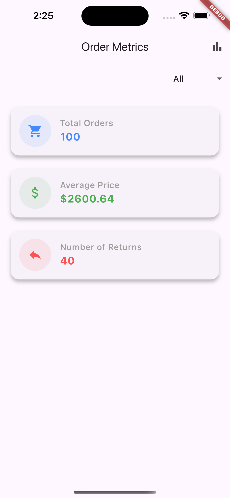
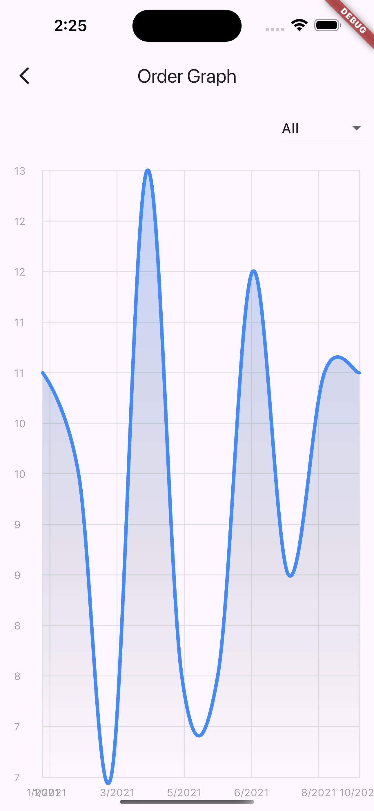

# **Orders Insight**

Orders Insight is a Flutter application that provides actionable insights into e-commerce orders. It
features a clean and user-friendly interface to help users analyze order data efficiently. The app
showcases key metrics and visualizes order trends, making it perfect for shop owners and data
enthusiasts.

---

## **Features**

- **Comprehensive Metrics**: View total order count, average price, and number of returns.
- **Interactive Graphs**: Analyze trends with a time-series graph of orders.
- **User-Friendly Design**: Designed for ease of use with a sleek and intuitive layout.

---

## Screenshots

   
